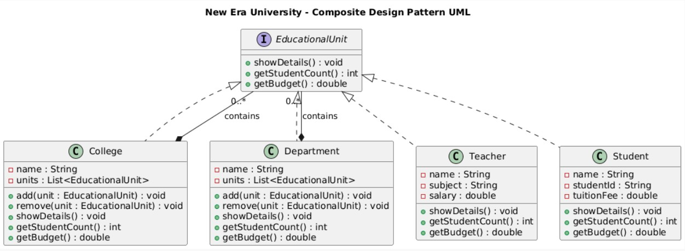

# New Era University Organizational System

This project implements a hierarchical management system for university structures using the Composite Design Pattern. It allows complex organizational trees—comprising colleges, departments, and individuals—to be managed through a unified interface.

---

## System Architecture

The following UML diagram illustrates how the system treats individual entities (Leafs) and containers (Composites) uniformly.



### Core Components
* **Component (EducationalUnit)**: The common interface defining methods for all units (details, student counts, and budgets).
* **Composites (College, Department)**: Units that can contain a collection of other EducationalUnit objects.
* **Leafs (Teacher, Student)**: Basic building blocks that perform specific actions but do not contain other units.

---

## Design Pattern Logic

By utilizing the Composite Pattern, the system simplifies client code. Whether you are interacting with a single Student or an entire College, you call the same methods (showDetails, getBudget), and the object handles the recursion internally.

---

## Key Features

### Hierarchical Recursion
The system supports deep nesting. For example, a College can contain multiple Departments, which in turn contain Teachers and Students.

### Automated Analytics
* **Student Count**: Automatically traverses the entire tree to provide a total headcount for any given level.
* **Budget Calculation**:
    * **Teachers** represent a cost (Salary).
    * **Students** represent revenue (Tuition Fee).
    * **Composites** aggregate these values to provide a net financial overview.

### Organized Reporting
The showDetails method allows for a structured printout of the entire hierarchy, making it easy to visualize the university's composition.

---

## How to Run

1. **Compile** the source files:
   ```bash
   javac *.java
